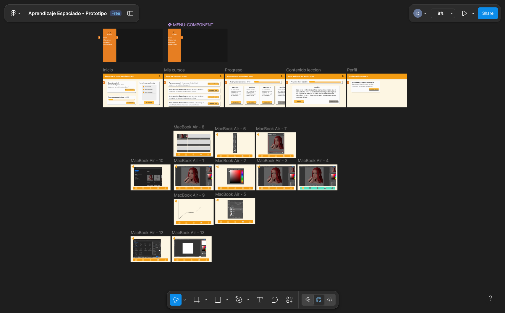

# NEUS - Plataforma de Aprendizaje / Learning Platform

> **Nota:** Este archivo README está disponible en **Español** e **Inglés**.
>
> **Note:** This README file is available in **Spanish** and **English**.

---

## 🇪🇸 Versión en Español

### 📖 Descripción
**NEUS** es una plataforma web educativa diseñada para facilitar el acceso a cursos y el seguimiento del aprendizaje estudiantil. Este proyecto representa una implementación fundamental de desarrollo web, enfocándose en una interfaz de usuario intuitiva, navegación fluida y la gestión de contenido educativo mediante lecciones interactivas.

El sistema permite a los usuarios navegar entre diferentes cursos (como Álgebra y Cálculo), visualizar su progreso y acceder a lecciones individuales a través de un sistema de sliders dinámico.

### ✨ Características Principales
* **Diseño Responsivo:** Interfaz adaptable a dispositivos móviles y de escritorio utilizando CSS moderno y Media Queries.
* **Navegación Dinámica:** Menú lateral (Sidebar) y barra de navegación superior para un acceso rápido a las secciones.
* **Gestión de Cursos:** Visualización de tarjetas de cursos con iconos y descripciones.
* **Sistema de Progreso:** Slider interactivo desarrollado en JavaScript para navegar entre lecciones.
* **Componentes Reutilizables:** Implementación de PHP (`include`) para modularizar el encabezado y el menú, facilitando el mantenimiento.
* **Perfiles de Usuario:** Interfaz para la visualización y edición de datos del estudiante.

### 🛠️ Tecnologías Utilizadas
* **HTML5:** Estructura semántica del sitio.
* **CSS3:** Estilos personalizados, variables CSS (`:root`) y diseño Flexbox.
* **JavaScript (Vanilla):** Lógica del lado del cliente para el carrusel de lecciones y la interactividad del menú.
* **PHP:** Utilizado para la inclusión dinámica de componentes (menús y headers).

### 🚀 Instalación y Uso
Para visualizar este proyecto en tu máquina local:

1.  Clona este repositorio o descarga los archivos.
2.  Asegúrate de tener un servidor local capaz de procesar PHP (como **XAMPP**, **MAMP**, o el servidor interno de PHP).
3.  Coloca la carpeta del proyecto en tu directorio raíz del servidor (ej. `htdocs`).
4.  Abre tu navegador y accede a `localhost/nombre-de-tu-carpeta/neus/index.php`.

### 👥 Autores

* **David Pinto Gómez** - *Desarrollo y Diseño*
    * [LinkedIn](https://www.linkedin.com/in/pinto-gomez-david/)
    * [GitHub](https://github.com/pintomultimedia2002)

* **Felipe Garcia** - *Colaboración y Desarrollo*
    * [LinkedIn](https://www.linkedin.com/in/felipe-garcia-1b718728b/)

---

## 🇺🇸 English Version

### 📖 Description
**NEUS** is an educational web platform designed to facilitate access to courses and track student learning progress. This project represents a fundamental implementation of web development, focusing on an intuitive user interface, smooth navigation, and content management through interactive lessons.

The system allows users to browse through different courses (such as Algebra and Calculus), view their progress, and access individual lessons via a dynamic slider system.

### ✨ Key Features
* **Responsive Design:** Interface adaptable to mobile and desktop devices using modern CSS and Media Queries.
* **Dynamic Navigation:** Sidebar and top navigation bar for quick access to sections.
* **Course Management:** Visualization of course cards with icons and descriptions.
* **Progress System:** Interactive slider built with JavaScript to navigate through lessons.
* **Reusable Components:** PHP implementation (`include`) to modularize headers and menus, facilitating maintenance.
* **User Profiles:** Interface for viewing and editing student data.

### 🛠️ Technologies Used
* **HTML5:** Semantic structure of the site.
* **CSS3:** Custom styling, CSS variables (`:root`), and Flexbox layout.
* **JavaScript (Vanilla):** Client-side logic for the lesson carousel and menu interactivity.
* **PHP:** Used for dynamic inclusion of components (menus and headers).

### 🚀 Installation and Usage
To view this project on your local machine:

1.  Clone this repository or download the files.
2.  Ensure you have a local server capable of processing PHP (such as **XAMPP**, **MAMP**, or the built-in PHP server).
3.  Place the project folder in your server's root directory (e.g., `htdocs`).
4.  Open your browser and go to `localhost/your-folder-name/neus/index.php`.

### 👥 Authors

* **David Pinto Gómez** - *Development & Design*
    * [LinkedIn](https://www.linkedin.com/in/pinto-gomez-david/)
    * [GitHub](https://github.com/pintomultimedia2002)

* **Felipe Garcia** - *Collaboration & Development*
    * [LinkedIn](https://www.linkedin.com/in/felipe-garcia-1b718728b/)
